# What is a disaster?

A disaster is a sudden, calamitous event that seriously disrupts the functioning of a community or society and causes human, material, and economic or environmental losses . Though often caused by nature, disasters can have human origins .

Disaster recovery is an organization's method of regaining access and functionality to its IT infrastructure after events like a natural disaster .

When planning for disaster recovery, evaluate your plan for these three main categories of disaster:

• Natural disasters, such as earthquakes or floods

• Technical failures, such as power failure or network connectivity

• Human actions, such as inadvertent misconfiguration or unauthorized/outside party access or
modification

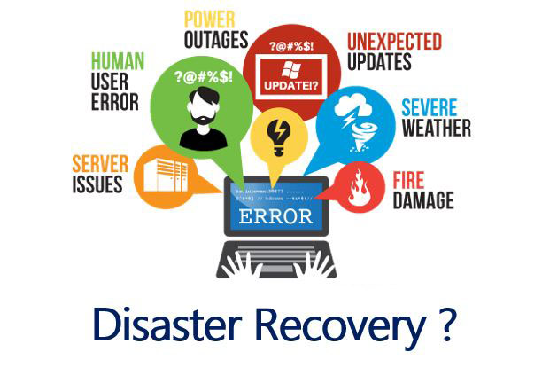

# High availability is not disaster recovery

Some of the key differences between High Availability and Disaster Recovery are:

• High Availability uses redundancy in the system to overcome any component failure . Basically desgined to recover Single server or Single Avalibily Zone .

For Example : Multizone Resource Deplyement , AutoScalling Group , Load balancer , DB read Replicas

• Disaster Recovery uses an alternate site or cloud services to restore normal or near normal function of the entire production system.

For example : Mutisite Hosting

# Business Continuity Plan (BCP)
• The plan ensures that personnel and assets are protected and are able to function quickly in the event of a disaster or failure. Your disaster recovery plan should be a subset of your organization’s business continuity plan (BCP).

• There are three primary aspects to a business continuity plan :
                            -High Avalibility
                            -Continious Operation
                            -Disater Recovery

• There is no point in maintaining aggressive disaster recovery targets for restoring a workload if that workload’s business objectives cannot be achieved

# Business impact analysis and risk assessment

• A business impact analysis should quantify the business impact of a disruption to your workloads. It should identify the impact on internal and external customers of not being able to use your workloads and the effect that has on your business.

• The analysis should help to determine how quickly the workload needs to be made available and how much data loss can be tolerated . However, it is important to note that recovery objectives should not be made in isolation; the probability of disruption and cost of recovery are key factors that help to inform the business value of providing disaster recovery for a workload .

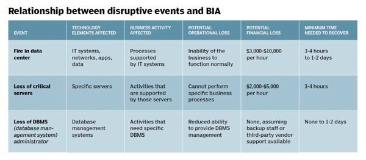

# Recovery objectives (RTO and RPO)
• When creating a Disaster Recovery (DR) strategy, organizations most commonly plan for the Recovery
Time Objective (RTO) and Recovery Point Objective (RPO).

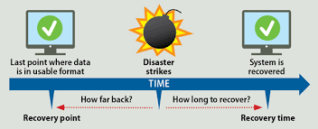

• Recovery Time Objective (RTO) is the maximum acceptable delay between the interruption of service
and restoration of service. 

• Recovery Point Objective (RPO) is the maximum acceptable amount of time since the last data recovery point. For Example If we have a daily backup then RPO would be 24 hours .

# Disaster recovery options in the cloud

# AWS 

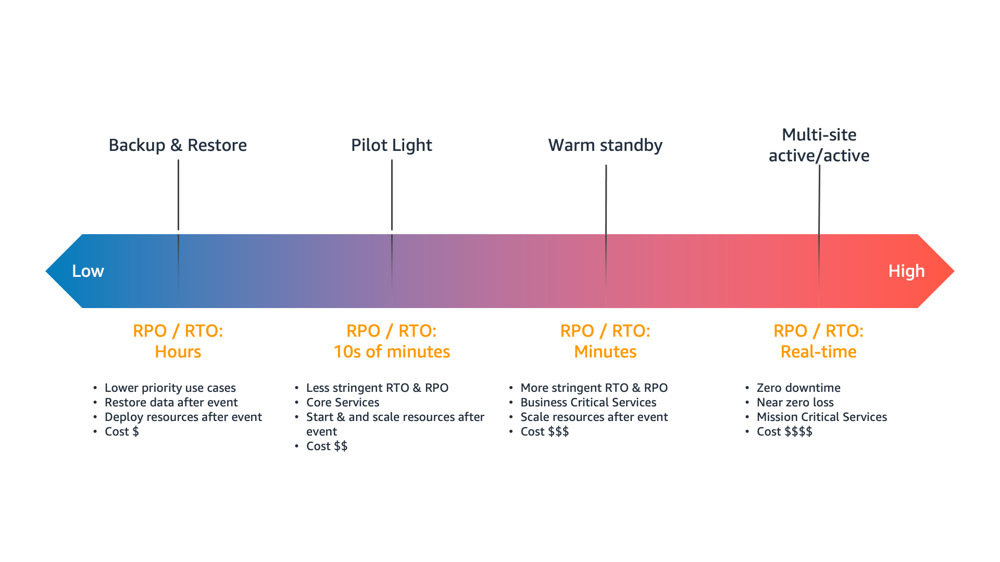
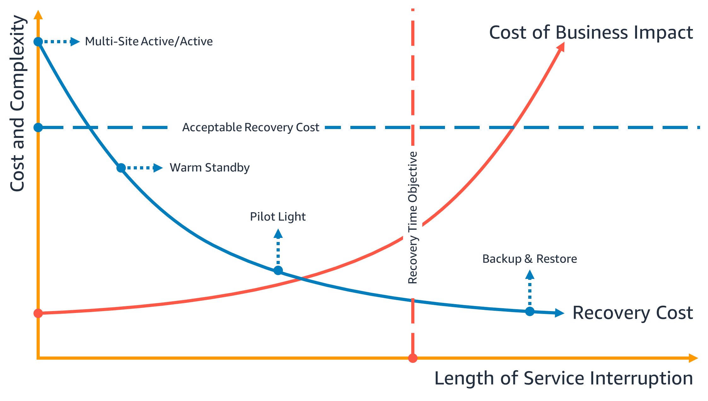

# Backup and restore

• Backup and restore is a suitable approach for mitigating against data loss or corruption. This approach can also be used to mitigate against a regional disaster by replicating data to other AWS Regions .

•To enable infrastructure to be redeployed quickly without errors, you should always deploy using infrastructure as code (IaC) using services such as AWS CloudFormation or the AWS Cloud Development Kit (CDK).

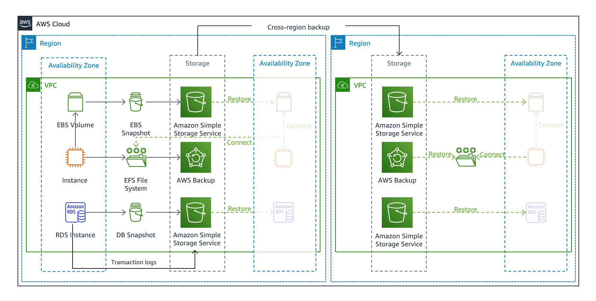

Different Back up Options :
  Amazon Elastic Block Store (Amazon EBS) snapshot
  Amazon DynamoDB backup
  Amazon RDS snapshot
  Amazon Aurora DB snapshot
  Amazon EFS backup (when using AWS Backup)
  Amazon Redshift snapshot
  Amazon Neptune snapshot

# Pilot light

• With the pilot light approach, you replicate your data from one Region to another and provision a copy of your core workload infrastructure. Resources required to support data replication and backup, such as databases and object storage, are always on. 

• Other elements, such as application servers, are loaded with application code and configurations, but are switched off and are only used during testing or when disaster recovery failover is invoked.

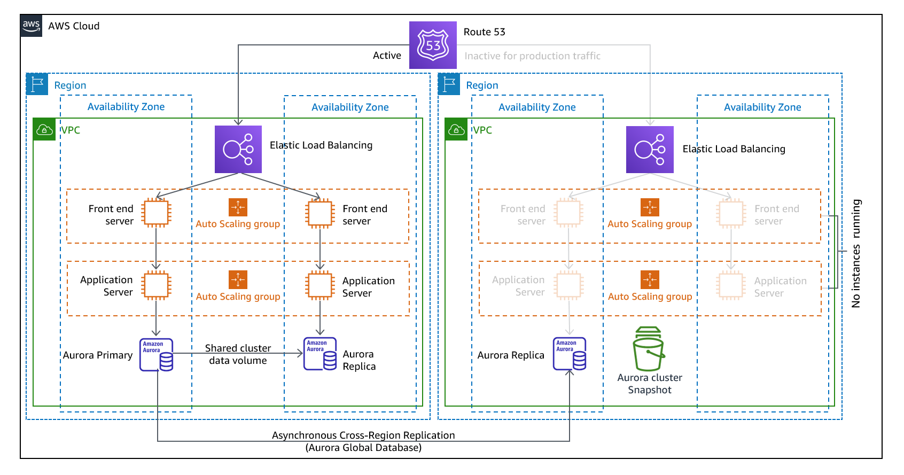

# Warm standby

• The warm standby approach involves ensuring that there is a scaled down, but fully functional, copy of your production environment in another Region. This approach extends the pilot light concept and decreases the time to recovery because your workload is always-on in another Region. 

• This approach also allows you to more easily perform testing or implement continuous testing to increase confidence in your ability to recover from a disaster.

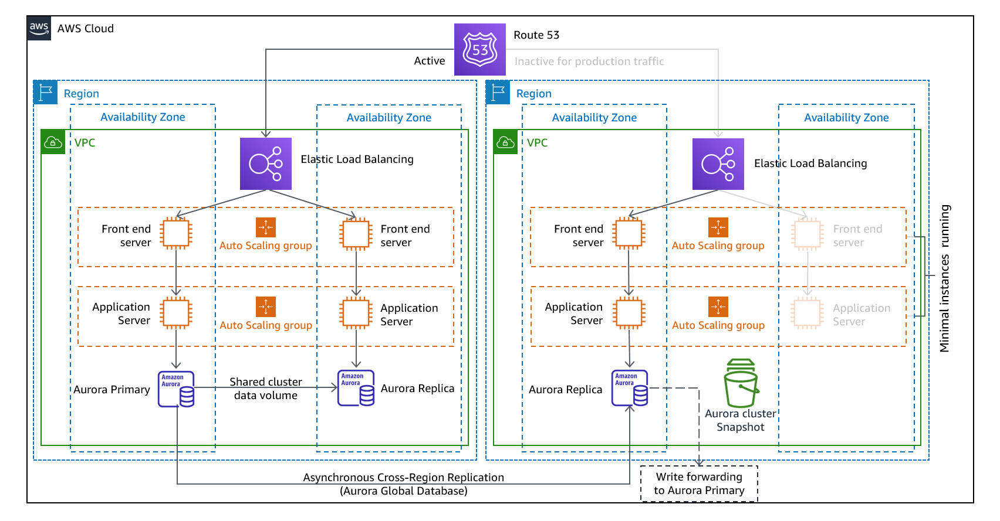

# Multi-site active/active

• You can run your workload simultaneously in multiple Regions as part of a multi-site active/active or hot standby active/passive strategy.
• Multi-site active/active serves traffic from all regions to which it is deployed, whereas hot standby serves traffic only from a single region, and the other Region(s) are only used for disaster recovery.
• With a multi-site active/active approach, users are able to access your workload in any of the Regions in which it is deployed.
• This approach is the most complex and costly approach to disaster recovery, but it can reduce your recovery time to near zero for most disasters with the correct technology choices and implementation 

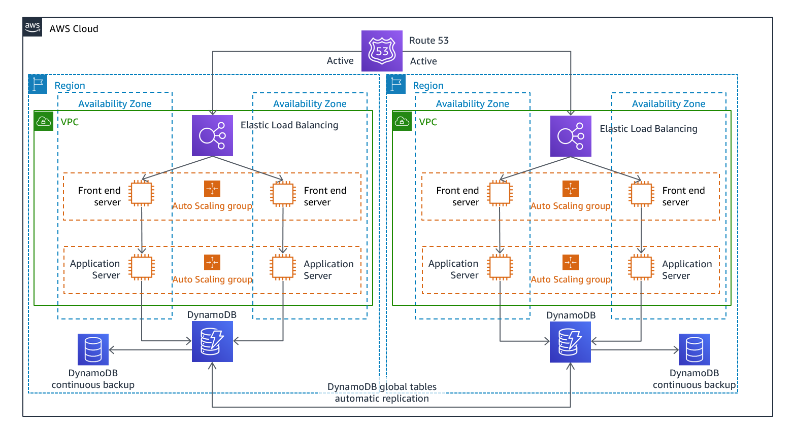

# CloudEndure Disaster Recovery

CloudEndure Disaster Recovery provides an easy solution for replicating and recovering workloads from other cloud providers to AWS. It automatically converts your source machines so that they boot and run natively on AWS.

It is n agent-based solution, you can migrate all applications and databases that run on supported versions of Windows and Linux OS.

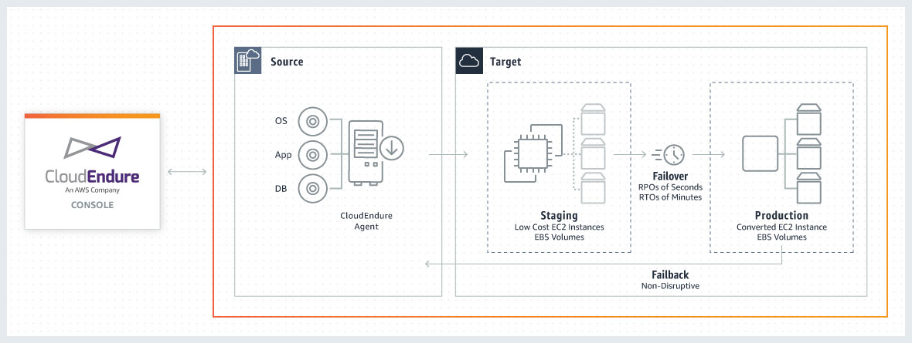

# AZURE

# Azure Backup service

The Azure Backup service provides simple, secure, and cost-effective solutions to back up your data and recover it from the Microsoft Azure cloud.

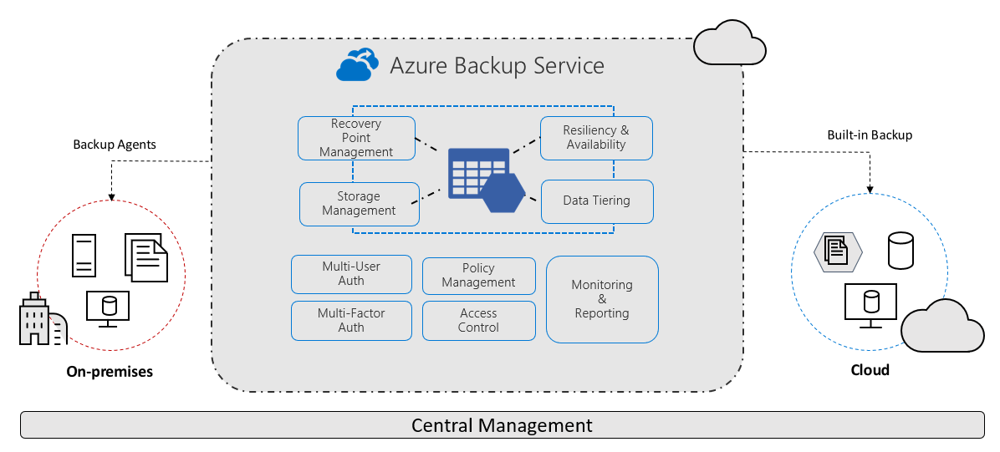

# Azure Site Recovery

Azure Site Recovery is Azure’s built-in disaster recovery as a service (DRaaS)

The Azure Site Recovery service contributes to your business continuity and disaster recovery (BCDR) strategy by keeping your business applications online during planned and unplanned outages. Site Recovery manages and orchestrates disaster recovery of on-premises machines and Azure virtual machines (VM), including replication, failover, and recovery.

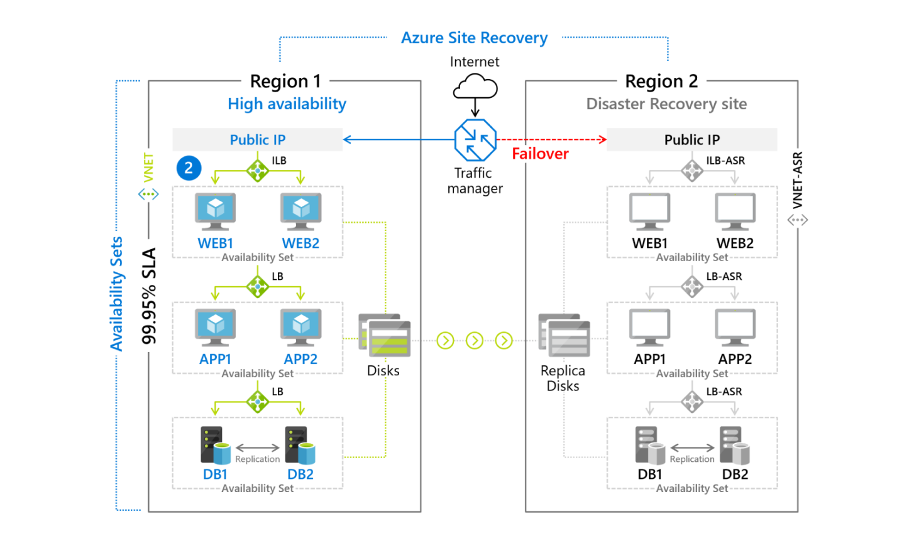

Backup ensures that your data is safe and recoverable while Site Recovery keeps your workloads available when/if an outage occurs .

RPO and RTO of Azure Site Recovery is lower compare to Azure Backup .

# Detection

It is important to know as soon as possible that your workloads are not delivering the business outcomes that they should be delivering. In this way, you can quickly declare a disaster and recover from an incident. 

For aggressive recovery objectives, this response time coupled with appropriate information
is critical in meeting recovery objectives. If your recovery point objective is one hour, then you need to detect the incident, notify appropriate personnel, engage your escalation processes, evaluate
information (if you have any) on expected time to recovery (without executing the DR plan), declare a
disaster and recover within an hour.

# Testing disaster recovery
Test disaster recovery implementation to validate the implementation and regularly test failover to your workload’s DR Region to ensure that RTO and RPO are met.

A pattern to avoid is developing recovery paths that are rarely executed. For example, you might have a secondary data store that is used for read-only queries. When you write to a data store and the primary fails, you might want to fail over to the secondary data store. If you don’t frequently test this failover, you might find that your assumptions about the capabilities of the secondary data store are incorrect.The capacity of the secondary, which might have been sufficient when you last tested, may be no longer be able to tolerate the load under this scenario, or service quotas in the secondary region may not be sufficient.

The only error recovery that works is the path you test frequently

# Conclusion
Customers are responsible for the availability of their applications in the cloud. It is important to define what a disaster is and to have a disaster recovery plan that reflects this definition and the impact that it may have on business outcomes .

